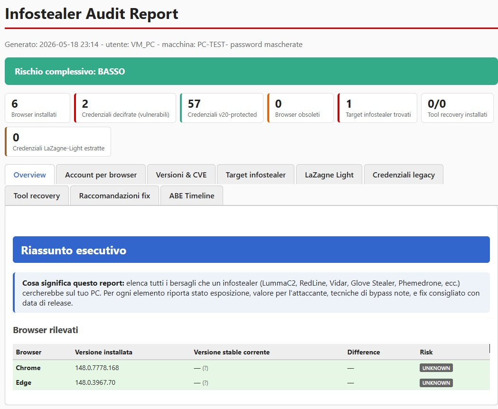

# ToolSicurezza

> **Defensive infostealer audit suite for Windows** — quantify exactly which
> credentials, browser data, and configuration items would be exposed to a
> hypothetical infostealer on your own machine, before the infection
> happens.

[](LICENSE)
[](https://www.python.org/)
[](https://www.microsoft.com/windows)
[](DISCLAIMER.md)



---

## ⚠️ Read first

This tool replicates, locally, what an infostealer malware (RedLine, Lumma,
Vidar, Kepavll, ...) would attempt against your computer. It is designed
**exclusively for defensive self-audit on systems you personally own**.
Before doing anything else, read [`DISCLAIMER.md`](DISCLAIMER.md) — by
running the tool you accept its terms.

> **Italiano:** `ToolSicurezza` è una suite difensiva: enumera tutte le
> credenziali che un malware (RedLine, Lumma, ecc.) ruberebbe dal tuo PC, e
> ti permette di vedere se la cifratura del tuo browser regge davvero. Solo
> sul TUO PC, solo a scopo educativo. La doc completa in italiano è in
> [`README_IT.md`](README_IT.md).

---

## What this project is

`ToolSicurezza` is a Python suite that performs nine categories of
read-only inspection on a Windows machine, all in user-mode (no kernel
driver, no malware, no remote exfiltration):

1. **Browser credential decryption** — Chrome / Edge / Brave / Vivaldi /
   Opera / Chromium (DPAPI + AES-GCM v10), Chrome v20 App-Bound Encryption
   detection, Firefox NSS (key4.db + logins.json, PBKDF2 + AES-256-CBC).
2. **Browser version vs. CVE** — local install version is compared against
   the current stable version fetched live from Google Chromium-Dash, Mozilla
   product-details, Microsoft EdgeUpdates, and the Brave GitHub releases
   API. Outdated browsers are flagged and matched against a curated
   vulnerability knowledge base.
3. **App-Bound Encryption timeline** — 20 documented infostealer families
   are mapped to the Chrome versions they targeted, the bypass techniques
   they used (COM IElevator, DLL injection, reflective process hollowing,
   debugger attach, chrome.dll signature scanning, server-side exfil), and
   the Chrome milestone that mitigated each technique.
4. **Aggressive mode** — optionally elevates to NT AUTHORITY\SYSTEM via a
   transient scheduled task to attempt v20 ABE decryption (will fail on
   modern Chrome by design — that *is* the result).
5. **Infostealer target detection** — Discord token storage, Steam
   `loginusers.vdf`, 25+ crypto wallet browser extensions, Telegram Desktop
   `tdata`, SSH/GPG keys, FileZilla, VPN configs, Windows Credential
   Manager.
6. **LaZagne-light built-in module** — pure-Python replica of the most
   useful LaZagne categories (Wi-Fi, PuTTY, WinSCP decrypt, Git
   credentials, OpenVPN, FileZilla, Thunderbird, Pidgin, DBVisualizer, RDP,
   Cisco AnyConnect) without depending on the Defender-flagged binary.
7. **External tool integration (optional)** — `pypykatz`,
   `browser_cookie3` are auto-installed via pip on first run and kept
   updated. PUA-flagged tools (LaZagne) require explicit opt-in.
8. **Tabbed HTML report** with risk scores, per-browser credential listings,
   per-credential cipher format & strength, sortable tables, dark-on-light
   colour-coded severity, and exportable JSON. **Fully localised** in
   Italian, English, French, German, and Spanish — auto-detected from the
   Windows locale, or forced with `--lang it/en/fr/de/es`.
9. **Fix recommendations** ordered by priority, each with the rationale and
   exact steps to remediate.

## Quick start

### Requirements

- Windows 10 / 11 (the tool uses DPAPI via `crypt32.dll`, so it does not
  work on Linux/macOS)
- Python 3.10 or later
- Network access (optional, only for live version-check; offline mode
  available with `--no-online`)
- Administrator privileges (optional, only required for the aggressive v20
  bypass attempt)

### Install

```powershell
git clone https://github.com/AlessioSavelli/ToolSicurezza.git
cd ToolSicurezza
py -m pip install -r requirements.txt
```

That's it. The remaining Python helpers (`pypykatz`, `browser_cookie3`) are
auto-installed by the tool itself on first run.

### Run

```powershell
# Comprehensive audit (default — passwords are masked)
py infostealer_audit.py

# Same audit but reveal decrypted passwords in the HTML report
py infostealer_audit.py --showpassword

# Offline, fast, no third-party tools installed
py infostealer_audit.py --no-online --no-tools

# Force report language (auto-detected by default from Windows locale)
py infostealer_audit.py --lang en   # English
py infostealer_audit.py --lang fr   # Français
py infostealer_audit.py --lang de   # Deutsch (alias: --lang du)
py infostealer_audit.py --lang es   # Español

# Deep password audit only (legacy companion script)
py pwd_audit.py
py pwd_audit.py --aggressive      # UAC prompt → SYSTEM elevation
py pwd_audit.py --lang it         # force Italian report
```

Reports are written to `./reports/infostealer_<timestamp>.html`. Open in
any browser.

> 📄 **Preview before running**: five sanitized demo reports
> (one per language, all personal data replaced with fictional
> placeholders) are available in
> [`wiki/demo-reports/`](wiki/demo-reports/).

## Example output

### Console (excerpt)

```
========================================================================
infostealer_audit.py v2 - audit superficie + accounts + tools
========================================================================
Lingua report:  it (auto-detect)
[1/9] KB loaded (Chrome stable reference: 148)

[2/9] Detecting installed browsers...
    Chrome       148.0.7778.168
    Edge         148.0.3967.70
    Firefox      NOT INSTALLED

[3/9] Live check for current stable versions...
    Chrome   latest: 148.0.7778.98 (2026-05-12) [chromiumdash.appspot.com]
    Firefox  latest: 150.0.3 (2026-05-12) [product-details.mozilla.org]
    Edge     latest: 148.0.3967.70 (2026-05-15) [edgeupdates.microsoft.com]
    Brave    latest: 1.90.122 (2026-05-13) [github.com/brave/brave-browser]

[4/9] External tool auto-install / update...
  [tool] pypykatz - mimikatz pure-Python    [ok] Already installed
  [tool] browser_cookie3                    [ok] Already installed
  [tool] lazagne - LaZagne                  [skip] PUA-flagged

[5/9] Matching versions against KB...
    Chrome v148: score 1/10, decrypt difficulty VERY_HARD
    Edge v148:   score 1/10, decrypt difficulty VERY_HARD

[6/9] Decrypting Chromium credentials...
    Chrome/Default:   0 v10 decrypted, 57 v20-protected
    Edge/Default:     2 v10 decrypted, 0 v20-protected

[7/9] Infostealer target detection + legacy creds...
    [!] Discord Token: PRESENT [HIGH]
    Credential Manager entries: 8

[8/9] LaZagne Light: Wi-Fi/PuTTY/WinSCP/Git/OpenVPN/...
    Wi-Fi:       n/a (wireless service not running)
    PuTTY:       0 sessions
    WinSCP:      0 sessions
    Git creds:   0
    [...]

[9/9] 2 fix recommendations generated

[OK] HTML report: D:\Desktop\ToolSicurezza\reports\infostealer_20260518_224717.html
```

### HTML report — tab layout

```
┌───────────────────────────────────────────────────────────────────────┐
│  Infostealer Audit Report                                             │
│  Overall risk: LOW   (banner colour-coded)                            │
├───────────────────────────────────────────────────────────────────────┤
│ [Overview] [Accounts] [Versions&CVE] [Targets] [LaZagne Light]        │
│ [Legacy] [Tools] [Fixes] [ABE Timeline]                               │
├───────────────────────────────────────────────────────────────────────┤
│                                                                       │
│  Browser       Installed     Current stable    Δ    Risk             │
│  Chrome        148.0.7778.168 148.0.7778.98    —    OK               │
│  Edge          148.0.3967.70  148.0.3967.70    —    OK               │
│                                                                       │
│  Stats: 2 browsers · 0 v10 decrypted · 57 v20-protected · 0 outdated │
│                                                                       │
└───────────────────────────────────────────────────────────────────────┘
```

> 📷 Screenshots of every tab are available in [`docs/screenshots/`](docs/screenshots/).

## Architecture

```
ToolSicurezza/
├── infostealer_audit.py        # Main orchestrator (9 tabs)
├── pwd_audit.py                # Legacy deep-password companion
├── sanitize_demo_reports.py    # Strips personal data from reports for demo
├── kb/
│   └── vulnerabilities.json    # ABE timeline + 20 infostealer families (v1.1)
├── modules/
│   ├── browser_versions.py     # Version detection + KB matching
│   ├── chromium_decrypt.py     # DPAPI + AES-GCM (v10/v20)
│   ├── external_tools.py       # pip auto-install: pypykatz, etc.
│   ├── firefox_nss.py          # NSS PBKDF2 + AES-256-CBC, no NSS lib
│   ├── i18n.py                 # Multilanguage strings (IT/EN/FR/DE/ES)
│   ├── infostealer_targets.py  # Discord/Steam/Wallets/SSH/etc.
│   ├── lazagne_light.py        # Built-in WiFi/PuTTY/WinSCP/Git/...
│   ├── legacy_decrypt.py       # CredMan, IE Vault, Outlook
│   └── online_versions.py      # Live version check
└── wiki/
    ├── *.md                    # Documentation pages
    └── demo-reports/           # Sanitized HTML demo reports (5 languages)
```

A detailed architecture diagram, sequence flows for each decryption path,
and an extension guide are available in the
[project wiki](wiki/Architecture.md).

## Documentation

The project wiki (in `wiki/`) contains:

| Page | Contents |
|---|---|
| [Home](wiki/Home.md) | Entry point, philosophy, scope |
| [Installation](wiki/Installation.md) | Prerequisites, install paths |
| [Quick Start](wiki/Quick-Start.md) | First-run walkthrough |
| [CLI Reference](wiki/CLI-Reference.md) | Every flag and what it does |
| [HTML Report](wiki/HTML-Report.md) | What each tab means + multilanguage |
| [Demo Reports](wiki/Demo-Reports.md) | Sanitized sample reports in 5 languages |
| [Architecture](wiki/Architecture.md) | Module map, data flow |
| [Knowledge Base](wiki/Knowledge-Base.md) | Schema of `vulnerabilities.json` |
| [Adding a Browser](wiki/Adding-a-Browser.md) | Extension guide |
| [FAQ](wiki/FAQ.md) | Common questions |
| [Troubleshooting](wiki/Troubleshooting.md) | When something doesn't work |
| [Threat Model](wiki/Threat-Model.md) | What we defend against, and what we don't |
| [Legal & Ethics](wiki/Legal-and-Ethics.md) | Expanded discussion of [DISCLAIMER.md](DISCLAIMER.md) |

## Contributing

Contributions are welcome, but please read
[CONTRIBUTING.md](CONTRIBUTING.md) and
[CODE_OF_CONDUCT.md](CODE_OF_CONDUCT.md) first.

The project explicitly **rejects** contributions that would:

- Add capabilities targeting other people's systems without consent.
- Include or download malware samples.
- Add network exfiltration features.
- Implement zero-day exploit code.

Welcome contributions:

- Additional defensive detections.
- New browser support.
- Updates to the vulnerability KB as new research is published.
- Translations of documentation.
- Bug fixes, code quality, tests.

## Security

If you discover a vulnerability in this software, please follow the
process in [SECURITY.md](SECURITY.md). Do **not** open public issues for
security problems.

## License

This project is released under the [MIT License](LICENSE), with the
Acceptable Use Notice attached at the bottom of the license file. By
using, building, or contributing to this software you also agree to the
terms set out in [DISCLAIMER.md](DISCLAIMER.md).

## Acknowledgements

Public research that made this project possible:

- [`xaitax/Chrome-App-Bound-Encryption-Decryption`](https://github.com/xaitax/Chrome-App-Bound-Encryption-Decryption) — first public v20 ABE bypass POC
- [`lclevy/firepwd`](https://github.com/lclevy/firepwd) — reference Firefox NSS algorithm
- [`AlessandroZ/LaZagne`](https://github.com/AlessandroZ/LaZagne) — reference for many recovery techniques
- [`skelsec/pypykatz`](https://github.com/skelsec/pypykatz) — mimikatz in Python
- [`runassu/chrome_v20_decryption`](https://github.com/runassu/chrome_v20_decryption) — v20 SYSTEM-DPAPI dual-unwrap research
- Cybereason, BleepingComputer, SpyCloud, DarkReading, Check Point Research,
  Cyble — published infostealer threat-intelligence reports

The Chrome release schedule and milestone information used in this project
is sourced from the public
[Chrome Releases blog](https://chromereleases.googleblog.com/) and the
[Chromium Dash](https://chromiumdash.appspot.com/).

## Disclaimer (TL;DR)

This tool is **defensive**. It runs on **your** computer. It analyses
**your** credentials. It does **not** transmit anything over the network.
The full legal/ethical statement is in [DISCLAIMER.md](DISCLAIMER.md).
By running the tool, you accept it.
